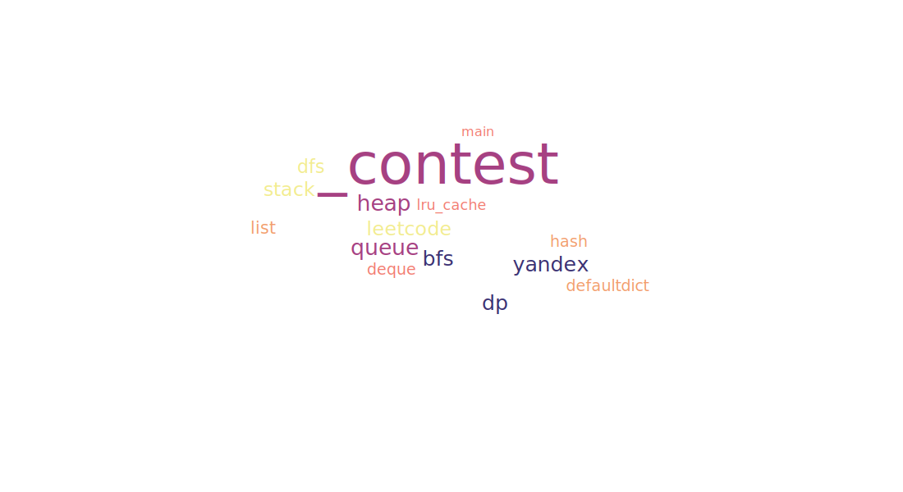

Here You can find my solutions to various algorithmic contests. 

Right now I have ready solutions of 75 problems from `Yandex Training 3.0` and several `leetcode` contests. 
The purpose of this repository is to a) **systematize my knowledge** and also to b) **help other people**. 
Unfortunately, not always optimal solutions in terms of asymptotics pass python tests. In my time, I killed a lot of time to
figure out the reason why. I hope this repository will at least help save other people's time in solving these problems :)
